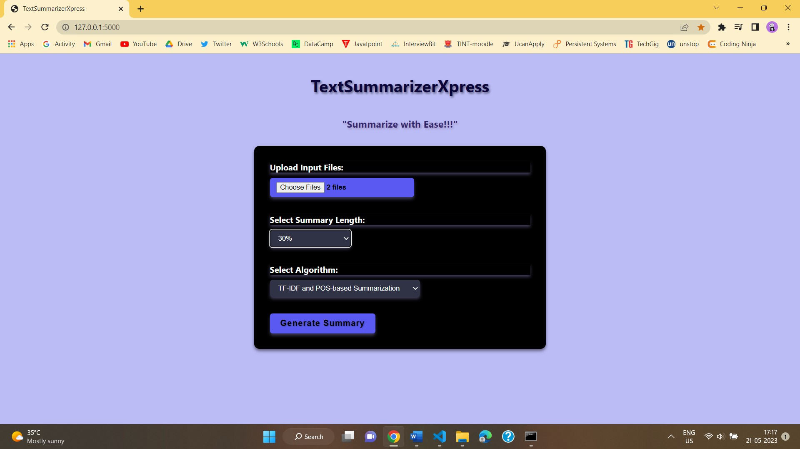

# TextSummarizerXpress

TextSummarizerXpress is a user-friendly web application that enables users to generate concise summaries of long textual documents. 
With the help of advanced natural language processing techniques and summarization algorithms, TextSummarizerXpress simplifies the 
process of extracting key information from lengthy texts, saving time and effort.

## Features

- **Easy Document Upload**: Users can effortlessly upload their text documents in various formats, including PDF, DOCX, and TXT.

- **Multiple Summarization Algorithms**: TextSummarizerXpress supports different summarization algorithms, such as TF-IDF, TextRank,
  and LSA, allowing users to choose the approach that best suits their needs.

- **Customization Options**: Users can customize the summarization process by specifying the desired length or percentage of the summary,
  selecting specific sections or topics to focus on, and adjusting the level of detail required.

- **User-Friendly Interface**: The intuitive user interface of TextSummarizerXpress makes it easy for users to navigate the application,
  upload documents, select summarization options, and view the generated summaries.

## Screenshots

*Figure 1: Input Page*

*Figure 2: Output Page*

## Getting Started

### Prerequisites

- Operating System: Windows 11
- Programming Language: Python

## Usage

1. Upload a Document: Click on the "Upload Document" button and select a text document from your computer.

2. Select Summarization Options: Choose the desired summarization algorithm and customize the length or percentage of the summary based
   on your preferences.

4. Generate Summary: Click on the "Generate Summary" button to process the document and generate the summary.

5. View Summary: The generated summary will be displayed on the screen. You can review and analyze the summarized content.

## Future Enhancements

- Multi-language Support: Expand the application to support document summarization in multiple languages.

- Integration with Cloud Storage: Enable users to directly access and summarize documents from popular cloud storage platforms.

- Mobile Application: Develop a mobile version of the application for convenient access on smartphones and tablets.

## Contributing

Contributions to TextSummarizerXpress are welcome! If you find any issues or have suggestions for improvements, please open an issue or 
submit a pull request.

Feel free to modify and customize this README file according to your project's specific details and requirements.

